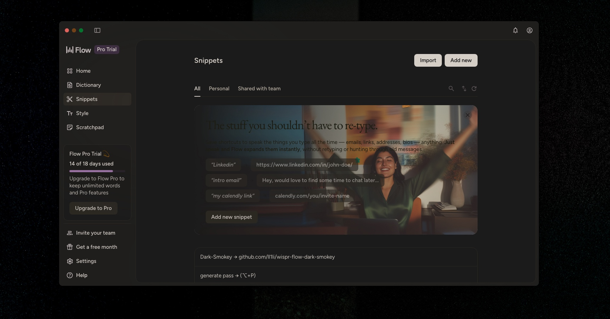

<h1 align="center">
  Wispr Flow Dark-Smokey
</h1>

<h4 align="center">A one-command dark theme for <a href="https://wispr.com/" target="_blank">Wispr Flow</a> on macOS.</h4>

<p align="center">
  <a href="https://github.com/ll1li/wispr-flow-dark-smokey/blob/main/LICENSE">
    
  </a>
  
  
  
</p>

<p align="center">
  <a href="#install">Install</a> •
  <a href="#usage">Usage</a> •
  <a href="#how-it-works">How It Works</a> •
  <a href="#license">License</a>
</p>

<p align="center">
  
</p>

---

Wispr Flow ships with a hardcoded white UI and no dark mode option. This script patches the Electron app bundle to inject a carefully tuned dark theme with warm smoky tones, uniform backgrounds, and clean outlines.

## Features

- **Uniform dark background** -- overrides internal CSS variables to eliminate sidebar/content color mismatch
- **Warm smoky tone** -- subtle sepia filter avoids the clinical white-on-black look
- **Dimmed text** -- comfortable reading without harsh contrast
- **Dark dialogs** -- modals, inputs, and popups are properly darkened
- **Clean outlines** -- thin borders on interactive elements for visual structure
- **Natural media** -- images and video are counter-inverted so they render correctly
- **Safe** -- creates a backup on first run, one-command restore at any time

## Install

```bash
mkdir -p ~/.local/bin
curl -fsSL https://raw.githubusercontent.com/ll1li/wispr-flow-dark-smokey/main/wispr-flow-dark-smokey \
  -o ~/.local/bin/wispr-flow-dark-smokey && chmod +x ~/.local/bin/wispr-flow-dark-smokey
```

> Make sure `~/.local/bin` is in your `PATH` (`export PATH="$HOME/.local/bin:$PATH"`).
> Alternatively, use `/usr/local/bin/` (may require `sudo`).

## Usage

```bash
# Apply dark mode (auto-restarts Wispr Flow)
wispr-flow-dark-smokey

# Restore original
wispr-flow-dark-smokey --restore
```

> **Note:** Wispr Flow auto-updates will overwrite the patch. Just re-run `wispr-flow-dark-smokey` after any update.

## How It Works

The script extracts Wispr Flow's Electron `app.asar` bundle, injects CSS overrides into the renderer HTML before `</head>`, and repacks it. A backup is saved as `app.asar.bak` on first run.

| Layer | What it does |
|-------|-------------|
| `filter: invert(0.88) hue-rotate(180deg)` | Flips the UI to dark while preserving color relationships |
| `--sand-*`, `--vast-*`, `--neutral-*` overrides | Forces all background shades to the same value |
| `sepia(0.15)` + `brightness(1.05)` | Adds warmth and balances contrast |
| Dialog/input overrides | Forces modals and form elements to invert properly |
| Counter-invert on `img, video, canvas` | Keeps media looking natural |

## Compatibility

| Wispr Flow | Dark-Smokey | Status |
|------------|-------------|--------|
| 1.4.x      | v1.2.0      | Tested |

If Wispr Flow restructures its renderer after an update, the script will detect the change and exit with an error instead of silently failing.

## Requirements

- macOS
- [Wispr Flow](https://wispr.com/) in `/Applications/`
- [Node.js](https://nodejs.org/) (uses `npx asar` to unpack/repack the bundle)
- Internet connection (first run only, to download `asar`)

## Disclaimer

This is an unofficial community project. It only modifies CSS styling in the renderer HTML -- no proprietary code is extracted, reverse-engineered, or redistributed. A backup of the original bundle is created automatically and can be restored at any time with `--restore`.

## License

[MIT](LICENSE)
