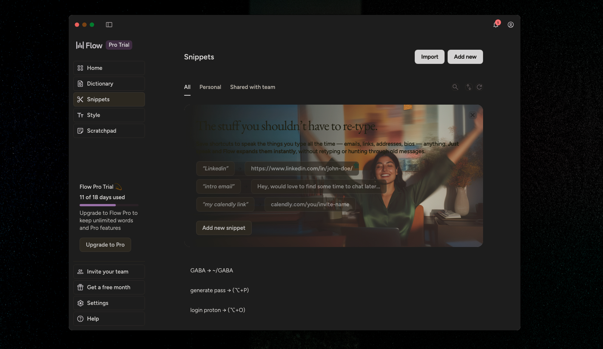

# Wispr Flow Dark Mode

A one-command dark mode patch for [Wispr Flow](https://wispr.com/) on macOS.



Wispr Flow ships with a hardcoded white UI and no dark mode option. This script patches the Electron app bundle to inject a carefully tuned dark theme with warm tones, uniform backgrounds, and clean outlines.

## What it does

- Inverts the entire UI to dark with balanced contrast
- Unifies sidebar and content backgrounds (no mismatched grays)
- Adds a subtle warm sepia tone to avoid clinical whites
- Dims text brightness for comfortable reading
- Removes heavy borders, adds clean thin outlines on interactive elements
- Counter-inverts images and media so they render naturally
- Creates a backup for easy one-command restore

## Install

```bash
curl -fsSL https://raw.githubusercontent.com/ll1li/wispr-flow-dark-mode/main/wispr-dark-mode -o /usr/local/bin/wispr-dark-mode
chmod +x /usr/local/bin/wispr-dark-mode
```

## Usage

```bash
# Apply dark mode
wispr-dark-mode

# Restart Wispr Flow
killall 'Wispr Flow' && open -a 'Wispr Flow'

# Restore original
wispr-dark-mode --restore
```

Re-run after Wispr Flow auto-updates -- the update will overwrite the patch.

## Requirements

- macOS
- [Wispr Flow](https://wispr.com/) installed in `/Applications/`
- Node.js (uses `npx asar` to unpack/repack the Electron bundle)

## How it works

The script extracts Wispr Flow's `app.asar` bundle, patches the hub and scratchpad renderer HTML with CSS overrides, and repacks it. A backup is saved as `app.asar.bak`.

The theme uses `filter: invert(0.94) hue-rotate(180deg)` on the root element, overrides Wispr's internal CSS color variables (`--sand-*`, `--vast-*`, `--neutral-*`) to produce a uniform dark background, and applies `sepia(0.08)` with `opacity: 0.92` for warmth and dimmed text.

## License

MIT
