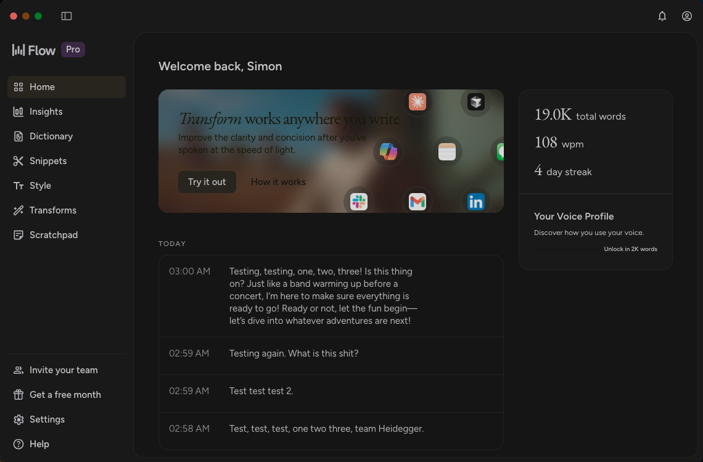

<h1 align="center">
  Wispr Flow Dark-Smokey
</h1>

<h4 align="center">A dark theme for <a href="https://wispr.com/" target="_blank">Wispr Flow</a> on macOS and Windows. One install, applied at once, and it stays dark through Wispr Flow's updates.</h4>

<p align="center">
  <a href="https://github.com/ll1li/wispr-flow-dark-smokey/blob/main/LICENSE">
    
  </a>
  
  
  
</p>

<p align="center">
  <a href="#why">Why</a> •
  <a href="#install">Install</a> •
  <a href="#usage">Usage</a> •
  <a href="#stays-dark-after-updates">Updates</a> •
  <a href="#how-it-works">How It Works</a> •
  <a href="#compatibility">Compatibility</a> •
  <a href="#license">License</a>
</p>

<p align="center">
  
</p>

<p align="center">
  <br>
  <sub>Wispr Flow 1.6 on Windows 11, themed by v1.5.0.</sub>
</p>

---

## Why

Wispr Flow ships with a hardcoded white UI and no dark mode option. If you use it at night, the default window is hard to ignore. This project patches Wispr Flow's Electron `app.asar` bundle to inject a neutral dark theme: dark without a strong colour cast, static instead of animated, and easy to apply or undo.

## Features

| | |
|---|---|
| **Neutral dark tone** | `invert(.91) hue-rotate(180deg) brightness(.93)` — deep dark without a colour cast |
| **Applied on install** | The installer patches Wispr Flow right away; no second command to run |
| **Survives updates** | A LaunchAgent (macOS) or scheduled task (Windows) re-applies the theme after Wispr Flow auto-updates, only when it is actually missing |
| **Zero GPU overhead** | No animated overlays, no atmospheric layers — static CSS only |
| **Anti-flashbang** | Dark backstop on `<html>` and `<body>` prevents bright white flashes during startup and navigation |
| **Uniform dark surfaces** | Overrides internal CSS variables so sidebar, content, and modals all match |
| **Natural media** | Images, video, and canvas are counter-inverted so they render correctly |
| **Atomic write** | Patches via temp file + rename, with size verification — never leaves a corrupt bundle |
| **Idempotent** | Strips prior patches before injecting; safe to re-run anytime |
| **Fast `--check`** | Reads asar bytes directly — no extract; exit code tells scripts the state |
| **One-command restore** | `--restore` reverts to the original in seconds, `--uninstall` removes everything |

## Install

Requires [Node.js](https://nodejs.org/) (for `npx`) and Wispr Flow installed. The installer puts the
command on your machine, applies the theme immediately, and switches on the re-apply hook described
under [Stays dark after updates](#stays-dark-after-updates). Wispr Flow restarts once while the theme
is applied.

### macOS

```bash
curl -fsSL https://raw.githubusercontent.com/ll1li/wispr-flow-dark-smokey/main/install-macos.sh | bash
```

Installs `wispr-flow-dark-smokey` to `/usr/local/bin` (uses `sudo` only if that directory is not
writable) and registers `~/Library/LaunchAgents/wispr-flow-dark-smokey.plist`.

Options: `bash -s -- --no-auto` skips the LaunchAgent, `--no-apply` installs the command only.
From a clone: `./install-macos.sh --from-clone`.

### Windows

Works in PowerShell 7+ and the built-in PowerShell 5.1:

```powershell
iwr -useb https://raw.githubusercontent.com/ll1li/wispr-flow-dark-smokey/main/install-windows.ps1 | iex
```

Installs `wispr-flow-dark-smokey.ps1` and a `.cmd` shim to `%USERPROFILE%\.local\bin\` and registers
the scheduled task `WisprFlowDarkSmokey` for the current user. If that directory is not on your
`PATH`, the installer prints the one-liner to add it; the theme and the task work without it.

Options: `-NoAuto` skips the scheduled task, `-NoApply` installs the command only, `-FromClone`
installs from a checkout:

```powershell
& ([scriptblock]::Create((iwr -useb https://raw.githubusercontent.com/ll1li/wispr-flow-dark-smokey/main/install-windows.ps1))) -NoAuto
```

> **Manual install:** copy the script(s) to a directory on your `PATH`, then run
> `wispr-flow-dark-smokey` and `wispr-flow-dark-smokey --enable-auto`.

## Usage

```bash
wispr-flow-dark-smokey                 # Apply the dark theme (restarts Wispr Flow)
wispr-flow-dark-smokey --restore       # Revert to the original
wispr-flow-dark-smokey --check         # Is it applied? exit 0 = yes, 1 = no
wispr-flow-dark-smokey --ensure        # Apply only if missing; quiet, never restarts a themed app
wispr-flow-dark-smokey --enable-auto   # Register the re-apply hook (LaunchAgent / scheduled task)
wispr-flow-dark-smokey --disable-auto  # Remove it
wispr-flow-dark-smokey --uninstall     # Restore Wispr Flow, remove the hook and the command
wispr-flow-dark-smokey --version
wispr-flow-dark-smokey --help
```

The same flags work on Windows. PowerShell-native style is also accepted (`-Restore`, `-Check`,
`-Ensure`, `-EnableAuto`, `-DisableAuto`, `-Uninstall`, `-Version`).

**Custom install path:** set `WISPR_PATH` to override the default Wispr Flow location:

```bash
# macOS
WISPR_PATH="/path/to/Wispr Flow.app" wispr-flow-dark-smokey

# Windows (PowerShell)
$env:WISPR_PATH = "D:\Apps\WisprFlow"; wispr-flow-dark-smokey
```

## Stays dark after updates

Wispr Flow auto-updates silently. On macOS the update overwrites the patched bundle; on Windows,
Squirrel installs the new version into a fresh `app-X.Y.Z\` directory. Either way the theme is gone
until something re-applies it. The installer sets that up:

| | macOS | Windows |
|---|---|---|
| Mechanism | per-user LaunchAgent `wispr-flow-dark-smokey` | per-user scheduled task `WisprFlowDarkSmokey` |
| Runs | at login, every hour, and whenever `app.asar` changes (`WatchPaths`) | one minute after logon and every 4 hours, hidden |
| Command | `wispr-flow-dark-smokey --ensure` | `wispr-flow-dark-smokey.ps1 --ensure` |
| Log | `$TMPDIR/wispr-flow-dark-smokey.log` | Task Scheduler history |
| Remove | `--disable-auto` | `--disable-auto` |

`--ensure` reads the bundle bytes first and exits immediately when the marker is present, so a
themed app is never touched or restarted. When the theme is missing it applies it, which restarts
Wispr Flow once. If applying fails on a given Wispr Flow build (for example a future restructure
of the renderer paths), `--ensure` remembers that build and does not retry it, so a broken update
cannot turn into an app that restarts every hour. Run `wispr-flow-dark-smokey` by hand to retry.

No admin rights, no password stored: the task and the agent run as you, in your session.

## Restore / Uninstall

```bash
wispr-flow-dark-smokey --restore     # original look back, keeps the command and the hook
wispr-flow-dark-smokey --uninstall   # restore + remove the hook + delete the command
```

## Troubleshooting

### `npx not found`

Install [Node.js](https://nodejs.org/). The patcher uses `npx` to run `@electron/asar@4.2.0`. The
scripts also look in the usual Homebrew, nodejs.org, nvm, fnm and volta locations, because launchd
and Task Scheduler start with a smaller `PATH` than your shell.

### `Wispr Flow not found`

Install Wispr Flow first, or set `WISPR_PATH` to a custom install location.

### The app is white again after an update

With the re-apply hook enabled this should fix itself within an hour (macOS) or four hours
(Windows), or at the next login. To force it now: `wispr-flow-dark-smokey`. If it keeps coming
back white, check the log (macOS) or Task Scheduler history (Windows): an apply that fails on a
new Wispr Flow build is recorded and not retried; that is the signal to update this project.

### Windows says the command is not found right after install

Open a new terminal window so the updated user `PATH` is picked up, or run the script directly from
`%USERPROFILE%\.local\bin\`.

## How It Works

The script extracts Wispr Flow's Electron bundle from a clean backup, injects a `<style>` block before `</head>` in each renderer's HTML, and repacks atomically. The first run saves a backup; all subsequent runs always extract from that clean backup, never from a previously patched file.

| Layer | What it does |
|-------|-------------|
| `filter: invert(.91) hue-rotate(180deg) brightness(.93)` on `html` | Flips the entire UI to dark while restoring hue relationships; `brightness(.93)` keeps it dark without overexposure |
| Background `#15131a` on `html` and `body` | Neutral dark with a faint cool tint — prevents white flash during paint |
| `--sand-*`, `--vast-*`, `--neutral-10` overrides | Equalises Wispr Flow's internal CSS variables so every surface inverts to the same depth |
| Counter-invert on `img, video, canvas` | Keeps media colours natural after the parent `html` inversion |
| Status bar CSS | Separate, invert-free stylesheet — the bar is natively dark and transparent |
| Scrollbar | 5 px, hover and active states, transparent track |

Four renderers are patched: `hub`, `scratchpad`, `contextMenu`, and `status`. The `meeting_recorder` renderer is intentionally left unpatched (transient window).

### Safety

- **Atomic writes** — patched bundle is written to a temp file on the same filesystem, the byte size is verified against the source, then atomically renamed into place; a partial write or truncated copy can never corrupt the live bundle
- **Backup integrity** — backup includes the `app.asar.unpacked/` directory so native binaries (e.g. Jabra connectors) are preserved
- **Graceful process handling** — Wispr Flow is killed before any file is touched and restarted from a `trap` / `finally` block whether the script succeeds or fails (10-second budget on Windows for slow handle release)
- **Post-inject verification** — the script checks for the CSS marker after injection and exits loudly if it is missing
- **Pinned asar version** — `@electron/asar@4.2.0`; no floating dependency, predictable behaviour
- **Backward-compatible strip** — the strip regex matches any `<style data-wispr-dark-smokey…>` marker, so upgrading from any v1.x install is a clean overwrite
- **No retry storms** — `--ensure` records a failed build and leaves it alone until you intervene

<details>
<summary>Platform-specific notes</summary>

### macOS security

Replacing `app.asar` invalidates the bundle's codesign seal. This is expected: Gatekeeper does not re-check previously approved apps, and Wispr Flow currently has no `ElectronAsarIntegrity` key in its `Info.plist`. If a future Wispr Flow release enables ASAR integrity verification, this script will fail at Wispr Flow startup rather than silently corrupt the app — check `Info.plist` after major updates.

### Windows / Squirrel

Wispr Flow on Windows ships with the Squirrel installer, which keeps each version in its own `app-X.Y.Z\` directory under `%LOCALAPPDATA%\WisprFlow\`. Auto-updates create a new versioned directory and the patched one is left orphaned — the script always resolves the latest `app-X.Y.Z\resources\app.asar` at runtime, and the scheduled task takes care of re-running.

There's a small race window: if Squirrel auto-updates between the script resolving the path and the atomic mv, the patch lands on the *previous* versioned directory while a new one is now active. The next `--ensure` run fixes it.

The `.cmd` shim picks `pwsh` (PowerShell 7+) when available and falls back to the built-in `powershell` (5.1). The scheduled task uses whichever host ran `--enable-auto`.

</details>

## Compatibility

| Wispr Flow | Dark-Smokey | Status |
|------------|-------------|--------|
| 1.6.x (Win) | v1.5.0      | Tested |
| 1.5.x (Win) | v1.4.0      | Tested |
| 1.5.x (Mac) | v1.5.0      | Tested |
| 1.4.x (Mac) | v1.4.0      | Tested |
| 1.3.x (Mac) | v1.4.0      | Tested |

If Wispr Flow restructures its renderer paths after an update, the script detects the missing file and exits with an error instead of silently failing.

## Requirements

- macOS or Windows 10/11
- [Wispr Flow](https://wispr.com/) installed
  - macOS: in `/Applications/` (or set `WISPR_PATH`)
  - Windows: default Squirrel install at `%LOCALAPPDATA%\WisprFlow\` (or set `WISPR_PATH`)
- [Node.js](https://nodejs.org/) (any version that includes `npx`)
- Internet connection on first run only (to download `@electron/asar@4.2.0`)

## Disclaimer

Unofficial community project. Only CSS styling in renderer HTML is modified — no proprietary code is extracted, reverse-engineered, or redistributed. The original bundle is backed up automatically and restored with `--restore`.

## License

[MIT](LICENSE)
